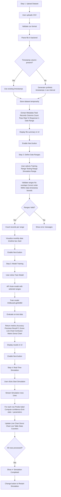

```mermaid
graph TD

%%STEP 1: Dataset Upload & Metadata
A1[Step 1: Upload Dataset] --> A2[User uploads CSV]
A2 --> A3[Validate csv format]
A3 --> A4[Parse file in backend]
A4 --> A5{Timestamp column present?}
A5 -- Yes --> A6[Use existing timestamps]
A5 -- No --> A7[Generate synthetic timestamps 1 sec interval]
A6 --> A8[Store dataset temporarily]
A7 --> A8
A8 --> A9[Extract Metadata Total Records Columns Count Pass Rate % Response=1 Date Range]
A9 --> A10[Display file summary in UI]
A10 --> A11[Enable Next button]

%% STEP 2: Date Range Selection
A11 --> B1[Step 2: Define Date Ranges]
B1 --> B2[User selects Training Range Testing Range Simulation Range]
B2 --> B3[Validate ranges No overlaps Correct order Within data timestamp bounds]
B3 --> B4{Ranges Valid?}
B4 -- Yes --> B5[Count records per range]
B5 --> B6[Visualize monthly data timeline bar chart]
B6 --> B7[Enable Next button]
B4 -- No --> B8[Show error messages]

%% STEP 3: Model Training
B7 --> C1[Step 3: Model Training]
C1 --> C2[User clicks Train Model]
C2 --> C3[API /train-model with selected ranges]
C3 --> C4[Train model XGBoost/LightGBM]
C4 --> C5[Evaluate on test data]
C5 --> C6[Return metrics Accuracy Precision Recall F1 Score Line Chart Confusion Matrix Donut Chart]
C6 --> C7[Display results in UI]
C7 --> C8[Enable Next button]

%% STEP 4: Simulation
C8 --> D1[Step 4: Real-Time Simulation]
D1 --> D2[User clicks Start Simulation]
D2 --> D3[Stream Simulation rows 1/sec]
D3 --> D4[For each row Predict label Compute confidence Emit stats + parameters]
D4 --> D5[Update Line Chart Donut Chart Live Table Stats Counters]
D5 --> D6{All rows processed?}
D6 -- Yes --> D7[Show ✔ Simulation Completed]
D7 --> D8[Change button to Restart Simulation]
```

